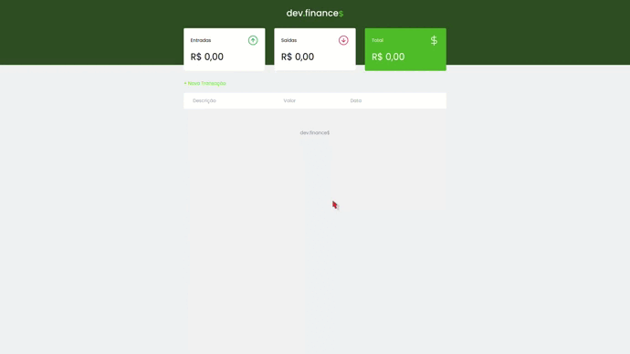

# Dev finance
## Maratona Discover Edição 1
### RocketSeat - Discover 🔥

---
<p>
  
  
  <a href="https://opensource.org/licenses/MIT">
    
  </a>
</p>

## About The project
dev.finances is a financial control application, where it is possible to register and delete transactions and see the incoming and outgoing balance

## Project Images


## Technologies

- [HTML](https://developer.mozilla.org/pt-BR/docs/Web/HTML)
- [CSS](https://developer.mozilla.org/pt-BR/docs/Web/CSS)
- [javascript](https://developer.mozilla.org/pt-BR/docs/Web/JavaScript)

## ⚙️🔧 Running The Project
```bash
# Clone this repository
git clone https://github.com/jorgeeder/dev-finance.git

# Acess dev-finance folder
cd dev-finance

# Open the file with your browser
index.html
```


Made with 💜 by [Jorge Eder](https://github.com/jorgeeder)

<p>
  <a href="https://www.linkedin.com/in/jorgeeder/">
      
  </a>
  <a href = "mailto:jorgeeder.dev@gmail.com">
  
  </a>
</p>